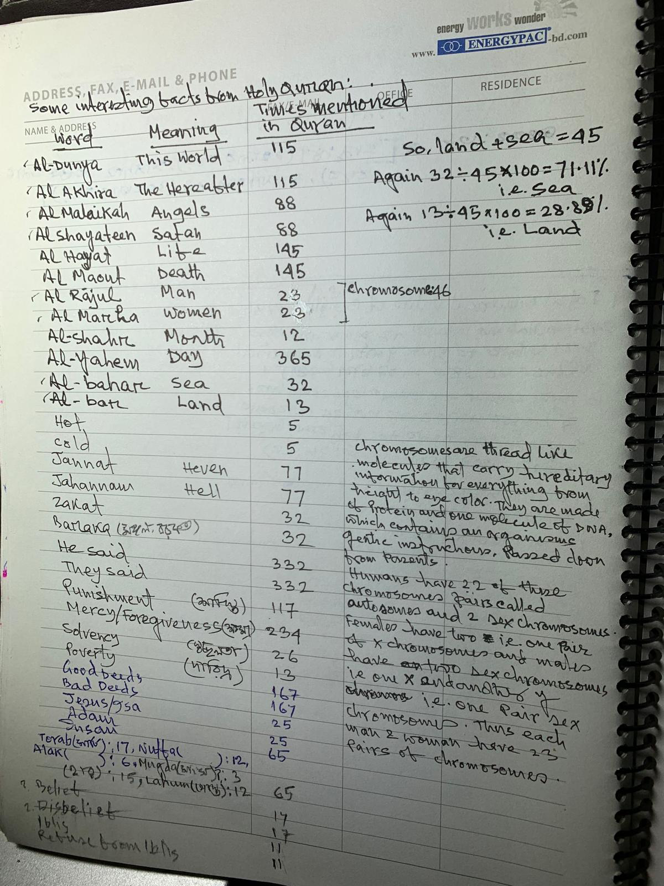

### Wikipedia: Quran Code
| Pattern           | Expected | Actual | Match |
|-------------------|----------|---------|-------|
| Bismillah Letters | 19       | 19      | ✓     |
| Ism (اسم)         | 19       | 15      | ✗     |
| Allah (الله)      | 2698     | 2553    | ✗     |
| Rahman (الرحمن)   | 57       | 47      | ✗     |
| Rahim (الرحيم)    | 114      | 36      | ✗     |
| Total Chapters    | 114      | 114     | ✓     |
| Total Verses      | 6346     | 6346    | ✓     |
| Verses Cross Sum  | 19       | 19      | ✓     |

### Divisibility
| Number | Patterns |
|--------|----------|
| 2      | 11       |
| 3      | 4        |
| 5      | 3        |
| 7      | 2        |
| 19     | 2        |
| 13     | 1        |

Total: 23 patterns across 6 numbers

